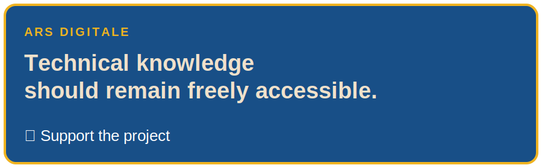

# Java 21 Study Guide

This repository contains a **structured, study guide for Java 21 (JDK 21 LTS)**.

It is designed as a **living handbook** to support:
- systematic revision of core and advanced Java concepts
- engineers who want a clear, organized reference aligned with modern Java

The project is intentionally **documentation-first**, with modular Markdown notes and accompanying code examples.

---

## ✅ Project status

- ✅ **English / Italian / French**: complete and aligned
- 📘 Slides, exercises, and solutions are **planned** but not yet published

This repository is public for educational purposes and evolves incrementally.

---

## 📖 Start here

➡️ **Course index (recommended entry point):**  
👉 [`INDEX.md`](INDEX.md)

The index provides the full curriculum with direct links to each module.

---

### ❤️ Keep technical knowledge freely accessible

<p align="center">
  <a href="https://secure.ars-digitale.com/b/fZu00j1TjfBqd4yd7Q43S03">
    
  </a>
</p>

---

## 📚 Repository structure

- **`docs/en/`** – Core course material in English (Markdown)
- **`docs/it/`**, **`docs/fr/`** – Italian and French translations
- **`code/`** – Java source code and examples aligned with the modules
- **`assets/`** – Images and diagrams used in the documentation
- **`slides/`** – *Planned* (not available yet)
- **`exercises/`** – *Planned* (not available yet)
- **`solutions/`** – *Planned* (not available yet)
- **`scripts/`** – Utilities for local Markdown → PDF generation

---

## 🌍 Languages

| Language | Status | Location |
|--------|--------|----------|
| 🇬🇧 English | Complete (reference) | `docs/en/` |
| 🇮🇹 Italiano | Complete | `docs/it/` |
| 🇫🇷 Français | Complete | `docs/fr/` |

If you would like to contribute to translations or corrections, see [`CONTRIBUTING.md`](CONTRIBUTING.md).

---

## 🧩 Requirements

- **JDK 21 (LTS)**
- Any Java IDE (Eclipse, IntelliJ IDEA, VS Code, NetBeans…)
- **Git**
- Optional: **Pandoc** (for local Markdown → PDF export)

---

## 🚀 How to use this repository

### 📖 Read the course

The primary content lives in:

```bash

docs/en/module-XX/

```


Each module focuses on a coherent set of Java 21 topics and can be read independently or sequentially.

---

### 💻 Explore the code

Java examples are located under `code/` and are intended to be:
- small
- focused

You can import them into your IDE as standard Java projects and run individual classes.

---

### 📄 Generate PDFs (optional, local)

Helper scripts are provided for local use:

- Linux / macOS: `scripts/md2pdf.sh`
- Windows: `scripts/md2pdf.bat`

These scripts are optional and not required to use the course on GitHub.

---

## 🧠 Curriculum overview

The guide currently covers:

- **Module 00** — Developer setup & prerequisites  
- **Module 01** — Java language basics  
- **Module 02** — Control flow  
- **Module 03** — Core APIs (strings, math, date/time…)  
- **Module 04** — OOP, inheritance, exceptions, generics  
- **Module 05** — Functional programming & streams  
- **Module 06** — Collections framework  
- **Module 07** — Concurrency & threads  
- **Module 08** — Files, I/O & NIO APIs  
- **Module 09** — JPMS (Java Platform Module System)

---

## 🤝 Contributing

Contributions are welcome:
- fixes and clarifications
- improvements to explanations
- improvements and corrections (EN / IT / FR)

Please read [`CONTRIBUTING.md`](CONTRIBUTING.md) before submitting changes.

---

## 📜 License

This project is released under the license specified in [`LICENSE`](LICENSE).

Unless otherwise stated, the material is intended for **educational use**.
© 2026 Alessandro Fabri  
