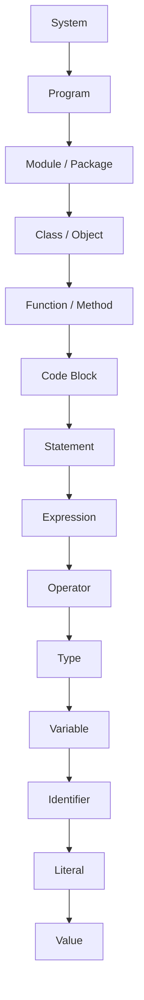

# 1. Syntax Building Blocks

<a id="table-of-contents"></a>
### Table of Contents


- [1.1 Value](#11-value)
- [1.2 Literal](#12-literal)
- [1.3 Identifier](#13-identifier)
- [1.4 Variable](#14-variable)
- [1.5 Type](#15-type)
- [1.6 Operator](#16-operator)
- [1.7 Expression](#17-expression)
- [1.8 Statement](#18-statement)
- [1.9 Code Block](#19-code-block)
- [1.10 Function / Method](#110--function--method)
- [1.11 Class / Object](#111-class--object)
- [1.12 Module / Package](#112-module--package)
- [1.13 Program](#113-program)
- [1.14 System](#114-system)
- [1.15 Summary as a Growing Scale](#115--summary-as-a-growing-scale)
- [1.16 Hierarchy Diagram ASCII](#116--hierarchy-diagram-ascii)
- [1.17 Hierarchy Diagram Mermaid](#117--hierarchy-diagram-mermaid)

---

Every software system or computer program is composed of a set of **data** and a set of **operations** that are applied to this data in order to produce a result.

More formally:

> A computer program consists of a collection of data structures that represent the state of the system, together with algorithms that specify the operations to be performed on this state in order to produce outputs.

This document describes a **hierarchy of abstractions**: the *elementary building blocks* which, combined into increasingly complex structures, form software.
  
The sequence is presented in **increasing order of complexity**, with general definitions (computer science) and Java references.

---

<a id="11-value"></a>
### 1.1 **Value**

- **Definition:** An abstract entity representing information (number, character, boolean, string, etc.).
- **Theory:** A value belongs to a mathematical domain (set), such as ℕ for natural numbers or Σ* for strings.
- **Example (abstract):** the number forty-two, the truth value *true*, the character "a".

**Java example (values):**

```java
// These are values:
42        // an int value
true      // a boolean value
'a'       // a char value
"Hello"   // a String value
```

---

<a id="12-literal"></a>
### 1.2 **Literal**

- **Definition:** A **literal** is the concrete notation in source code that directly denotes a fixed value.
- **In Java:** `42`, `'a'`, `true`, `"Hello"`.
- **Theory:** A literal is *syntax*, while a value is its *semantics*.
- **Note:** Literals are the most common way to introduce values into programs.

**Java example (literals):**

```java
int answer = 42;          // 42 is an int literal
char letter = 'a';        // 'a' is a char literal
boolean flag = true;      // true is a boolean literal
String msg = "Hello";     // "Hello" is a String literal
```

---

<a id="13-identifier"></a>
### 1.3 **Identifier**

- **Definition:** A symbolic name that associates a value (or a structure) with a readable label.
- **In Java:**
	- **User-defined identifiers:** chosen by the programmer to name variables, methods, classes, etc.  
Examples: `x`, `counter`, `MyClass`, `calculateSum`.
	- **Keywords (reserved words):** predefined names reserved by the Java language and cannot be redefined.  
Examples: `class`, `public`, `static`, `if`, `return`.

!!! note
    Identifiers must follow Java naming rules: see [Java Naming Rules](naming-rules.md).

- **Theory:** Binding function: connects a name to a value or resource.

**Java example (identifiers):**

```java
int counter = 0;          // counter is an identifier (variable name)
String userName = "Bob";  // userName is an identifier
class MyService { }       // MyService is a class identifier
```

---

<a id="14-variable"></a>
### 1.4 **Variable**

- **Definition:** A “memory cell” labeled by an identifier, which can hold and change value.
- **In Java:** `int counter = 0; counter = counter + 1;`.
- **Theory:** A mutable state that can vary over time during execution.

**Java example (variable changing over time):**

```java
int counter = 0;       // variable initialized
counter = counter + 1; // variable updated
counter++;             // another update (post-increment)
```

---

<a id="15-type"></a>
### 1.5 **Type**

- **Definition:** A type is a set of values and a set of operations permitted on those values.
- **In Java:**
	- **Primitive (simple) types:** directly represent basic values.  
  Examples: `int`, `double`, `boolean`, `char`, `byte`, `short`, `long`, `float`.
	- **Reference types:** represent references (pointers) to objects in memory.  
  Examples: `String`, arrays (e.g., `int[]`), classes, interfaces, and user-defined types.

!!! note
    See [Java Data Types](data-types.md).

- **Theory:** A type system is the set of rules that associates sets of values and admissible operations.

**Java example (types):**

```java
int age = 30;           // int type
double price = 9.99;    // double type
boolean active = true;  // boolean type
String name = "Alice";  // reference type (class String)
```

---

<a id="16-operator"></a>
### 1.6 **Operator**

- **Definition:** A **symbol or keyword** that performs a computation or action on one or more operands.
- **Role:** Operators combine values, variables, and expressions to produce new values or to modify program state.
- **In Java:**  

!!! note
    See [Java Operators](java-operators.md).

- **Theory:** Operators define allowable computations over types; together with values and variables, they form **expressions**.

**Java example (operators in context):**

```java
int a = 5 + 3;          // + arithmetic
boolean ok = a > 3;     // > comparison
ok = ok && true;        // && logical
a += 2;                 // += assignment
int sign = (a >= 0) ? 1 : -1; // ?: ternary
```

---

<a id="17-expression"></a>
### 1.7 **Expression**

- **Definition:** A combination of values, literals, variables, operators, and functions that produces a new value.
- **In Java:** `x + 3`, `Math.sqrt(25)`, `"Hello" + " world"`.
- **Theory:** A syntax tree that evaluates to a result.

**Java example (expressions):**

```java
int x = 10;
int y = x + 3;               // x + 3 is an expression
double r = Math.sqrt(25);    // Math.sqrt(25) is an expression
String msg = "Hello" + " ";  // "Hello" + " " is an expression
msg = msg + "world";         // msg + "world" is another expression
```

---

<a id="18-statement"></a>
### 1.8 **Statement**

- **Definition:** A unit of execution that modifies state or controls flow.
- **In Java:** `x = x + 1;`, `if (x > 0) { ... }`.
- **Theory:** A sequence of actions that does not return a value as a result of the statement itself, but changes the configuration of the abstract machine.

**Java example (statements):**

```java
int x = 0;                // declaration statement
x = x + 1;                // assignment statement

if (x > 0) {              // if statement
    System.out.println("Positive");
}
```

---

<a id="19-code-block"></a>
### 1.9 **Code Block**

- **Definition:** A set of statements enclosed between delimiters forming an executable unit.
- **In Java:** `{ int y = 5; x = x + y; }`.
- **Theory:** A sequential composition of statements, with rules of *scope* (visibility).

**Java example (code block and scope):**

```java
int x = 10;

{
    int y = 5;        // y is only visible inside this block
    x = x + y;        // OK: x is visible here
}

// y is not visible here
// x is still visible here
```

---

<a id="110--function--method"></a>
### 1.10  **Function / Method**

- **Definition:** A sequence of encapsulated statements, identified by a name, which can receive inputs (parameters) and return an output (value).
- **In Java:**

```java
int square(int n) {
    return n * n;
}
```

- **Theory:** A mapping between input and output domains, with an operational body.

**Java usage example:**

```java
int result = square(5); // result = 25
```

---

<a id="111-class--object"></a>
### 1.11 **Class / Object**

- **Definition:**
- - **Class:** abstract description of a set of objects (state + behavior).
- - **Object:** a concrete instance of the class.

- **In Java:**

```java
class Point {
    int x, y;

    void move(int dx, int dy) {
        x += dx;
        y += dy;
    }
}

Point p = new Point();   // p is an object (instance of Point)
p.move(1, 2);            // method call on the object
```

- **Theory:** Abstraction of an *ADT* (Abstract Data Type).

---

<a id="112-module--package"></a>
### 1.12 **Module / Package**

- **Definition:** Logical grouping of classes, functions, and resources with a common purpose.
- **In Java:** `package java.util;` → collects utilities.
- **Theory:** Mechanism of organization and reuse, reducing complexity.

**Java example (package):**

```java
package com.example.app;

public class Main {
    public static void main(String[] args) {
        System.out.println("Hello");
    }
}
```

---

<a id="113-program"></a>
### 1.13 **Program**

- **Definition:** A coherent set of modules, classes, and functions that, when executed on a machine, realizes a global behavior.
- **In Java:** The `main` method and everything it invokes.
- **Theory:** A specification of transformations from input to output on an abstract machine.

**Java example (minimal program):**

```java
public class HelloWorld {
    public static void main(String[] args) {
        System.out.println("Hello, Java 21!");
    }
}
```

---

<a id="114-system"></a>
### 1.14 **System**

- **Definition:** A set of cooperating programs that interact with external resources (user, network, devices).
- **Example:** An enterprise Java platform with database, REST services, UI.
- **Theory:** Complex architecture of software and hardware components.

**Example (conceptual):**

- A Java backend (Spring Boot service)
- A database (PostgreSQL)
- A front-end web app
- External services (REST APIs, message queues)

Together they form a *system*.

---

<a id="115--summary-as-a-growing-scale"></a>
### 1.15 📌 Summary as a Growing Scale

`Value → Literal → Identifier → Variable → Type → Operator → Expression → Statement → Code Block → Function/Method → Class/Object → Module/Package → Program → System`

This scale shows how small conceptual units are combined into larger and more complex structures.

---

<a id="116--hierarchy-diagram-ascii"></a>
### 1.16 📊 Hierarchy Diagram (ASCII)

**Description:** This ASCII diagram shows the hierarchical relation between building blocks, from the most complex (System) down to the simplest (Value and its concrete form, the Literal).

```text
System
└── Program
    └── Module / Package
        └── Class / Object
            └── Function / Method
                └── Code Block
                    └── Statement
                        └── Expression
                            └── Operator
                                └── Type
                                    └── Variable
                                        └── Identifier
                                            └── Literal
                                                └── Value
```

---

<a id="117--hierarchy-diagram-mermaid"></a>
### 1.17 📊 Hierarchy Diagram (Mermaid)

**Description:** The Mermaid diagram renders the same hierarchy in a top-down tree. It highlights that a Literal is the syntactic form of a Value.


