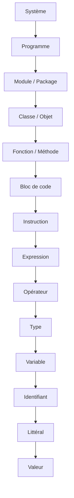

# 1. Blocs Syntaxiques Fondamentaux

### Table des matières
- [1. Blocs Syntaxiques Fondamentaux](#1-blocs-syntaxiques-fondamentaux)
	- [1.1 Valeur](#11-valeur)
	- [1.2 Littéral](#12-littéral)
	- [1.3 Identifiant](#13-identifiant)
	- [1.4 Variable](#14-variable)
	- [1.5 Type](#15-type)
	- [1.6 Opérateur](#16-opérateur)
	- [1.7 Expression](#17-expression)
	- [1.8 Instruction](#18-instruction)
	- [1.9 Bloc de code](#19-bloc-de-code)
	- [1.10 Fonction / Méthode](#110-fonction--méthode)
	- [1.11 Classe / Objet](#111-classe--objet)
	- [1.12 Module / Package](#112-module--package)
	- [1.13 Programme](#113-programme)
	- [1.14 Système](#114-système)
	- [1.15 Résumé sous forme d’échelle croissante](#115--résumé-sous-forme-déchelle-croissante)
	- [1.16 Diagramme hiérarchique ASCII](#116--diagramme-hiérarchique-ascii)
	- [1.17 Diagramme hiérarchique Mermaid](#117--diagramme-hiérarchique-mermaid)

---

Tout système logiciel ou programme informatique est composé d’un ensemble de **données** et d’un ensemble **d’opérations** appliquées à ces données afin de produire un résultat.

Plus formellement :

> Un programme informatique consiste en un ensemble de structures de données représentant l’état du système, accompagné d’algorithmes qui spécifient les opérations à effectuer sur cet état pour produire des sorties.

Ce document décrit une **hiérarchie d’abstractions** : les *blocs élémentaires* qui, combinés en structures de plus en plus complexes, forment un logiciel.
  
La séquence est présentée dans un **ordre croissant de complexité**, avec des définitions générales (informatique) et des références à Java.

---

### 1.1 **Valeur**

- **Définition :** Entité abstraite représentant une information (nombre, caractère, booléen, chaîne, etc.).
- **Théorie :** Une valeur appartient à un domaine (ensemble) mathématique, comme ℕ pour les nombres naturels ou Σ* pour les chaînes de caractères.
- **Exemple (abstrait) :** le nombre quarante-deux, la valeur de vérité *true*, le caractère « a ».

**Exemple Java (valeurs) :**

```java
// Voici des valeurs :
42        // une valeur int
true      // une valeur boolean
'a'       // une valeur char
"Hello"   // une valeur String
```

---

### 1.2 **Littéral**

- **Définition :** Un **littéral** est la notation concrète dans le code source qui désigne directement une valeur fixe.
- **En Java :** `42`, `'a'`, `true`, `"Hello"`.
- **Théorie :** Un littéral est de la **syntaxe**, tandis que la valeur correspond à sa **sémantique**.
- **Remarque :** Les littéraux sont la manière la plus courante d’introduire des valeurs dans les programmes.

**Exemple Java (littéraux) :**

```java
int answer = 42;          // 42 est un littéral int
char letter = 'a';        // 'a' est un littéral char
boolean flag = true;      // true est un littéral boolean
String msg = "Hello";     // "Hello" est un littéral String
```

---

### 1.3 **Identifiant**

- **Définition :** Nom symbolique qui associe une valeur (ou une structure) à une étiquette lisible.
- **En Java :**
  - **Identifiants définis par l’utilisateur :** choisis par le programmeur pour nommer variables, méthodes, classes, etc.  
    Exemples : `x`, `counter`, `MyClass`, `calculateSum`.
  - **Mots-clés (réservés) :** noms prédéfinis réservés par le langage Java et qui ne peuvent pas être redéfinis.  
    Exemples : `class`, `public`, `static`, `if`, `return`.

!!! note
    Les identifiants doivent respecter les règles de nommage de Java : voir *Java Naming Rules*.

- **Théorie :** Fonction de liaison (binding) : relie un nom à une valeur ou une ressource.

**Exemple Java (identifiants) :**

```java
int counter = 0;          // counter est un identifiant (nom de variable)
String userName = "Bob";  // userName est un identifiant
class MyService { }       // MyService est un identifiant de classe
```

---

### 1.4 **Variable**

- **Définition :** « Case mémoire » étiquetée par un identifiant, qui peut contenir et changer de valeur.
- **En Java :** `int counter = 0; counter = counter + 1;`.
- **Théorie :** État mutable susceptible d’évoluer pendant l’exécution.

**Exemple Java (variable qui évolue dans le temps) :**

```java
int counter = 0;       // variable initialisée
counter = counter + 1; // variable mise à jour
counter++;             // autre mise à jour (post-incrément)
```

---

### 1.5 **Type**

- **Définition :** Un type est un ensemble de valeurs et un ensemble d’opérations autorisées sur ces valeurs.
- **En Java :**
  - **Types primitifs (simples) :** représentent directement des valeurs de base.  
    Exemples : `int`, `double`, `boolean`, `char`, `byte`, `short`, `long`, `float`.
  - **Types référence :** représentent des références (pointeurs) vers des objets en mémoire.  
    Exemples : `String`, tableaux (par ex. `int[]`), classes, interfaces et types définis par l’utilisateur.

!!! note
    Voir *Java Data Types*.

- **Théorie :** Un système de types est l’ensemble des règles qui associent des ensembles de valeurs et des opérations admissibles.

**Exemple Java (types) :**

```java
int age = 30;           // type int
double price = 9.99;    // type double
boolean active = true;  // type boolean
String name = "Alice";  // type référence (classe String)
```

---

### 1.6 **Opérateur**

- **Définition :** **Symbole ou mot-clé** qui effectue un calcul ou une action sur un ou plusieurs opérandes.
- **Rôle :** Les opérateurs combinent valeurs, variables et expressions pour produire de nouvelles valeurs ou modifier l’état du programme.
- **En Java :**

!!! note
    Voir *Java Operators*.

- **Théorie :** Les opérateurs définissent les calculs autorisés sur les types ; avec les valeurs et variables, ils forment les **expressions**.

**Exemple Java (opérateurs en contexte) :**

```java
int a = 5 + 3;          // + arithmétique
boolean ok = a > 3;     // > comparaison
ok = ok && true;        // && logique
a += 2;                 // += affectation composée
int sign = (a >= 0) ? 1 : -1; // ?: ternaire
```

---

### 1.7 **Expression**

- **Définition :** Combinaison de valeurs, littéraux, variables, opérateurs et fonctions produisant une nouvelle valeur.
- **En Java :** `x + 3`, `Math.sqrt(25)`, `"Hello" + " world"`.
- **Théorie :** Arbre syntaxique qui, une fois évalué, donne un résultat.

**Exemple Java (expressions) :**

```java
int x = 10;
int y = x + 3;               // x + 3 est une expression
double r = Math.sqrt(25);    // Math.sqrt(25) est une expression
String msg = "Hello" + " ";  // "Hello" + " " est une expression
msg = msg + "world";         // msg + "world" est une autre expression
```

---

### 1.8 **Instruction**

- **Définition :** Unité d’exécution qui modifie l’état ou contrôle le flot d’exécution.
- **En Java :** `x = x + 1;`, `if (x > 0) { ... }`.
- **Théorie :** Séquence d’actions qui ne renvoie pas de valeur en tant que résultat de l’instruction elle-même, mais modifie la configuration de la machine abstraite.

**Exemple Java (instructions) :**

```java
int x = 0;                // déclaration (instruction de définition)
x = x + 1;                // instruction d’affectation

if (x > 0) {              // instruction if
    System.out.println("Positive");
}
```

---

### 1.9 **Bloc de code**

- **Définition :** Ensemble d’instructions délimitées formant une unité exécutable.
- **En Java :** `{ int y = 5; x = x + y; }`.
- **Théorie :** Composition séquentielle d’instructions, avec des règles de *portée* (visibilité).

**Exemple Java (bloc de code et portée) :**

```java
int x = 10;

{
    int y = 5;        // y n’est visible qu’à l’intérieur de ce bloc
    x = x + y;        // OK : x est visible ici
}

// y n’est plus visible ici
// x est toujours visible ici
```

---

### 1.10 **Fonction / Méthode**

- **Définition :** Séquence d’instructions encapsulée, identifiée par un nom, pouvant recevoir des entrées (paramètres) et renvoyer une sortie (valeur).
- **En Java :**

```java
int square(int n) {
    return n * n;
}
```

- **Théorie :** Application (mapping) entre domaines d’entrée et de sortie, avec un corps opérationnel.

**Exemple d’utilisation Java :**

```java
int result = square(5); // result = 25
```

---

### 1.11 **Classe / Objet**

- **Définition :**
  - **Classe :** description abstraite d’un ensemble d’objets (état + comportement).
  - **Objet :** instance concrète de la classe.

- **En Java :**

```java
class Point {
    int x, y;

    void move(int dx, int dy) {
        x += dx;
        y += dy;
    }
}

Point p = new Point();   // p est un objet (instance de Point)
p.move(1, 2);            // appel de méthode sur l’objet
```

- **Théorie :** Abstraction d’un *ADT* (Abstract Data Type, type de donnée abstrait).

---

### 1.12 **Module / Package**

- **Définition :** Regroupement logique de classes, fonctions et ressources partageant un objectif commun.
- **En Java :** `package java.util;` → regroupe des utilitaires.
- **Théorie :** Mécanisme d’organisation et de réutilisation, réduisant la complexité.

**Exemple Java (package) :**

```java
package com.example.app;

public class Main {
    public static void main(String[] args) {
        System.out.println("Hello");
    }
}
```

---

### 1.13 **Programme**

- **Définition :** Ensemble cohérent de modules, classes et fonctions qui, lorsqu’il est exécuté sur une machine, réalise un comportement global.
- **En Java :** La méthode `main` et tout ce qu’elle invoque.
- **Théorie :** Spécification de transformations d’entrées en sorties sur une machine abstraite.

**Exemple Java (programme minimal) :**

```java
public class HelloWorld {
    public static void main(String[] args) {
        System.out.println("Hello, Java 21!");
    }
}
```

---

### 1.14 **Système**

- **Définition :** Ensemble de programmes coopérant qui interagissent avec des ressources externes (utilisateur, réseau, périphériques).
- **Exemple :** Une plateforme Java d’entreprise avec base de données, services REST, interface utilisateur.
- **Théorie :** Architecture complexe de composants logiciels et matériels.

**Exemple (conceptuel) :**

- Un backend Java (service Spring Boot)
- Une base de données (PostgreSQL)
- Une application web front-end
- Des services externes (API REST, files de messages)

Ensemble, ils forment un **système**.

---

### 1.15 📌 Résumé sous forme d’échelle croissante

`Valeur → Littéral → Identifiant → Variable → Type → Opérateur → Expression → Instruction → Bloc de code → Fonction/Méthode → Classe/Objet → Module/Package → Programme → Système`

Cette échelle montre comment de petites unités conceptuelles sont combinées en structures de plus en plus grandes et complexes.

---

### 1.16 📊 Diagramme hiérarchique (ASCII)

**Description :** Ce diagramme ASCII montre la relation hiérarchique entre les blocs de construction, du plus complexe (Système) au plus simple (Valeur et sa forme concrète, le Littéral).

```text
Système
└── Programme
    └── Module / Package
        └── Classe / Objet
            └── Fonction / Méthode
                └── Bloc de code
                    └── Instruction
                        └── Expression
                            └── Opérateur
                                └── Type
                                    └── Variable
                                        └── Identifiant
                                            └── Littéral
                                                └── Valeur
```

---

### 1.17 📊 Diagramme hiérarchique (Mermaid)

**Description :** Le diagramme Mermaid rend la même hiérarchie sous forme d’arbre descendant. Il met en évidence qu’un Littéral est la forme syntaxique d’une Valeur.


