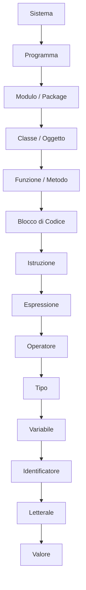

# 1. Mattoni Sintattici di Base

### Indice
- [1. Mattoni Sintattici di Base](#1-mattoni-sintattici-di-base)
	- [1.1 Valore](#11-valore)
	- [1.2 Letterale](#12-letterale)
	- [1.3 Identificatore](#13-identificatore)
	- [1.4 Variabile](#14-variabile)
	- [1.5 Tipo](#15-tipo)
	- [1.6 Operatore](#16-operatore)
	- [1.7 Espressione](#17-espressione)
	- [1.8 Istruzione](#18-istruzione)
	- [1.9 Blocco di Codice](#19-blocco-di-codice)
	- [1.10 Funzione / Metodo](#110-funzione--metodo)
	- [1.11 Classe / Oggetto](#111-classe--oggetto)
	- [1.12 Modulo / Package](#112-modulo--package)
	- [1.13 Programma](#113-programma)
	- [1.14 Sistema](#114-sistema)
	- [1.15 Riepilogo come scala crescente](#115--riepilogo-come-scala-crescente)
	- [1.16 Diagramma gerarchico ASCII](#116--diagramma-gerarchico-ascii)
	- [1.17 Diagramma gerarchico Mermaid](#117--diagramma-gerarchico-mermaid)

---

Ogni sistema software o programma informatico è composto da un insieme di **dati** e da un insieme di **operazioni** che vengono applicate a questi ultimi per produrre un risultato.

Più formalmente:

> Un programma informatico consiste in una collezione di strutture dati che rappresentano lo stato del sistema, insieme ad algoritmi che specificano le operazioni da eseguire su questo stato per produrre degli output.

Questo documento descrive una **gerarchia di astrazioni**: i *mattoni elementari* che, combinati in strutture via via più complesse, formano il software.
  
La sequenza è presentata in **ordine crescente di complessità**, con definizioni generali (informatica) e riferimenti a Java.

---

### 1.1 **Valore**

- **Definizione:** Entità astratta che rappresenta informazione (numero, carattere, boolean, stringa, ecc.).
- **Teoria:** Un valore appartiene a un dominio (insieme) matematico, come ℕ per i numeri naturali o Σ* per le stringhe.
- **Esempio (astratto):** il numero quarantadue, il valore di verità *true*, il carattere "a".

**Esempio Java (valori):**

```java
// Questi sono valori:
42        // un valore int
true      // un valore boolean
'a'       // un valore char
"Hello"   // un valore String
```

---

### 1.2 **Letterale**

- **Definizione:** Un **letterale** è la notazione concreta nel codice sorgente che denota direttamente un valore fisso.
- **In Java:** `42`, `'a'`, `true`, `"Hello"`.
- **Teoria:** Un letterale è **sintassi**, mentre il valore è la sua **semantica**.
- **Nota:** I letterali sono il modo più comune per introdurre valori nei programmi.

**Esempio Java (letterali):**

```java
int answer = 42;          // 42 è un letterale int
char letter = 'a';        // 'a' è un letterale char
boolean flag = true;      // true è un letterale boolean
String msg = "Hello";     // "Hello" è un letterale String
```

---

### 1.3 **Identificatore**

- **Definizione:** Un nome simbolico che associa un valore (o una struttura) a un’etichetta leggibile.
- **In Java:**
  - **Identificatori definiti dall’utente:** scelti dal programmatore per nominare variabili, metodi, classi, ecc.  
    Esempi: `x`, `counter`, `MyClass`, `calculateSum`.
  - **Parole chiave (keyword, riservate):** nomi predefiniti riservati dal linguaggio Java che non possono essere ridefiniti.  
    Esempi: `class`, `public`, `static`, `if`, `return`.

> [!NOTE]  
> Gli identificatori devono rispettare le regole di naming di Java: vedi [Regole di naming Java](naming-rules.md)

- **Teoria:** Funzione di binding: collega un nome a un valore o a una risorsa.

**Esempio Java (identificatori):**

```java
int counter = 0;          // counter è un identificatore (nome di variabile)
String userName = "Bob";  // userName è un identificatore
class MyService { }       // MyService è un identificatore di classe
```

---

### 1.4 **Variabile**

- **Definizione:** Una “cella di memoria” etichettata da un identificatore, che può contenere e cambiare valore.
- **In Java:** `int counter = 0; counter = counter + 1;`.
- **Teoria:** Uno stato mutabile che può variare nel tempo durante l’esecuzione.

**Esempio Java (variabile che cambia nel tempo):**

```java
int counter = 0;       // variabile inizializzata
counter = counter + 1; // variabile aggiornata
counter++;             // altro aggiornamento (post-incremento)
```

---

### 1.5 **Tipo**

- **Definizione:** Un tipo è un insieme di valori e un insieme di operazioni consentite su tali valori.
- **In Java:**
  - **Tipi primitivi (semplici):** rappresentano direttamente valori di base.  
    Esempi: `int`, `double`, `boolean`, `char`, `byte`, `short`, `long`, `float`.
  - **Tipi reference:** rappresentano riferimenti (puntatori) a oggetti in memoria.  
    Esempi: `String`, array (ad es. `int[]`), classi, interfacce e tipi definiti dall’utente.

> [!NOTE]  
> Vedi [Tipi di dato Java e casting](data_types.md).

- **Teoria:** Un sistema di tipi è l’insieme di regole che associa insiemi di valori e operazioni ammissibili.

**Esempio Java (tipi):**

```java
int age = 30;           // tipo int
double price = 9.99;    // tipo double
boolean active = true;  // tipo boolean
String name = "Alice";  // tipo reference (classe String)
```

---

### 1.6 **Operatore**

- **Definizione:** Un **simbolo o parola chiave** che esegue un calcolo o un’azione su uno o più operandi.
- **Ruolo:** Gli operatori combinano valori, variabili ed espressioni per produrre nuovi valori o modificare lo stato del programma.
- **In Java:**

> [!NOTE]  
> Vedi [Operatori Java](java-operators.md).

- **Teoria:** Gli operatori definiscono le computazioni ammesse sui tipi; insieme a valori e variabili formano le **espressioni**.

**Esempio Java (operatori nel contesto):**

```java
int a = 5 + 3;          // + aritmetico
boolean ok = a > 3;     // > di confronto
ok = ok && true;        // && logico
a += 2;                 // += assegnazione
int sign = (a >= 0) ? 1 : -1; // ?: ternario
```

---

### 1.7 **Espressione**

- **Definizione:** Una combinazione di valori, letterali, variabili, operatori e funzioni che produce un nuovo valore.
- **In Java:** `x + 3`, `Math.sqrt(25)`, `"Hello" + " world"`.
- **Teoria:** Un albero sintattico (syntax tree) che viene valutato producendo un risultato.

**Esempio Java (espressioni):**

```java
int x = 10;
int y = x + 3;               // x + 3 è un’espressione
double r = Math.sqrt(25);    // Math.sqrt(25) è un’espressione
String msg = "Hello" + " ";  // "Hello" + " " è un’espressione
msg = msg + "world";         // msg + "world" è un’altra espressione
```

---

### 1.8 **Istruzione**

- **Definizione:** Unità di esecuzione che modifica lo stato o controlla il flusso.
- **In Java:** `x = x + 1;`, `if (x > 0) { ... }`.
- **Teoria:** Sequenza di azioni che non restituisce un valore come risultato dell’istruzione stessa, ma cambia la configurazione della macchina astratta.

**Esempio Java (istruzioni):**

```java
int x = 0;                // istruzione di dichiarazione
x = x + 1;                // istruzione di assegnazione

if (x > 0) {              // istruzione if
    System.out.println("Positivo");
}
```

---

### 1.9 **Blocco di Codice**

- **Definizione:** Insieme di istruzioni racchiuse tra delimitatori che formano un’unità eseguibile.
- **In Java:** `{ int y = 5; x = x + y; }`.
- **Teoria:** Composizione sequenziale di istruzioni, con regole di *scope* (visibilità).

**Esempio Java (blocco di codice e scope):**

```java
int x = 10;

{
    int y = 5;        // y è visibile solo dentro questo blocco
    x = x + y;        // OK: x è visibile qui
}

// y non è visibile qui
// x è ancora visibile qui
```

---

### 1.10 **Funzione / Metodo**

- **Definizione:** Sequenza di istruzioni incapsulata, identificata da un nome, che può ricevere input (parametri) e restituire un output (valore).
- **In Java:**

```java
int square(int n) {
    return n * n;
}
```

- **Teoria:** Una mappatura tra domini di input e di output, con un corpo operativo.

**Esempio di utilizzo in Java:**

```java
int result = square(5); // result = 25
```

---

### 1.11 **Classe / Oggetto**

- **Definizione:**
  - **Classe:** descrizione astratta di un insieme di oggetti (stato + comportamento).
  - **Oggetto:** istanza concreta della classe.

- **In Java:**

```java
class Point {
    int x, y;

    void move(int dx, int dy) {
        x += dx;
        y += dy;
    }
}

Point p = new Point();   // p è un oggetto (istanza di Point)
p.move(1, 2);            // chiamata di metodo sull’oggetto
```

- **Teoria:** Astrazione di un *ADT* (Abstract Data Type, tipo di dato astratto).

---

### 1.12 **Modulo / Package**

- **Definizione:** Raggruppamento logico di classi, funzioni e risorse con uno scopo comune.
- **In Java:** `package java.util;` → raccoglie utilità varie.
- **Teoria:** Meccanismo di organizzazione e riuso, riduce la complessità.

**Esempio Java (package):**

```java
package com.example.app;

public class Main {
    public static void main(String[] args) {
        System.out.println("Hello");
    }
}
```

---

### 1.13 **Programma**

- **Definizione:** Insieme coerente di moduli, classi e funzioni che, quando eseguiti su una macchina, realizzano un comportamento globale.
- **In Java:** Il metodo `main` e tutto ciò che esso invoca.
- **Teoria:** Specifica di trasformazioni da input a output su una macchina astratta.

**Esempio Java (programma minimale):**

```java
public class HelloWorld {
    public static void main(String[] args) {
        System.out.println("Hello, Java 21!");
    }
}
```

---

### 1.14 **Sistema**

- **Definizione:** Insieme di programmi cooperanti che interagiscono con risorse esterne (utente, rete, dispositivi).
- **Esempio:** Una piattaforma Java enterprise con database, servizi REST, interfaccia utente.
- **Teoria:** Architettura complessa di componenti software e hardware.

**Esempio (concettuale):**

- Un backend Java (servizio Spring Boot)
- Un database (PostgreSQL)
- Una web app front-end
- Servizi esterni (API REST, code di messaggi)

Insieme formano un **sistema**.

---

### 1.15 📌 Riepilogo come scala crescente

`Valore → Letterale → Identificatore → Variabile → Tipo → Operatore → Espressione → Istruzione → Blocco di Codice → Funzione/Metodo → Classe/Oggetto → Modulo/Package → Programma → Sistema`

Questa scala mostra come unità concettuali piccole vengano combinate in strutture progressivamente più grandi e complesse.

---

### 1.16 📊 Diagramma gerarchico (ASCII)

**Descrizione:** Questo diagramma ASCII mostra la relazione gerarchica tra i mattoni, dal più complesso (Sistema) al più semplice (Valore e la sua forma concreta, il Letterale).

```text
Sistema
└── Programma
    └── Modulo / Package
        └── Classe / Oggetto
            └── Funzione / Metodo
                └── Blocco di Codice
                    └── Istruzione
                        └── Espressione
                            └── Operatore
                                └── Tipo
                                    └── Variabile
                                        └── Identificatore
                                            └── Letterale
                                                └── Valore
```

---

### 1.17 📊 Diagramma gerarchico (Mermaid)

**Descrizione:** Il diagramma Mermaid rende la stessa gerarchia in un albero dall’alto verso il basso. Evidenzia che il Letterale è la forma sintattica di un Valore.


